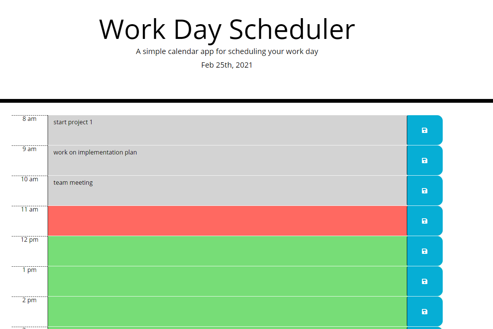

# Work Day Scheduler
The Work Day Scheduler allows you to set up a daily planner based on the work day hours of 8 am to 5 pm. 
Each hour is color-coded based on if the time has past, is the current hour, or later in the day.

## Installation
Click [to use the daily work day scheduler](https://hrkoren.github.io/workday_scheduler/)

## Usage 

1. Open the URL
2. View the time slots ⏲️
    🟥 shows the current hour
    🟩 shows future time slots
    Any times with a gray background represent previous hours in the day.
3. Type to-do, meeting, etc. items into a time slot, then click the Save button.
4. When the page is reloaded your saved planner items will be available for you to reference.

## License

This project is not licensed.

## Thanks

A huge thank you to my tutor for showing me some cool JQuery techniques and one of the TA's for helping me figure out a quicker way to retrieve the saved items from local storage.